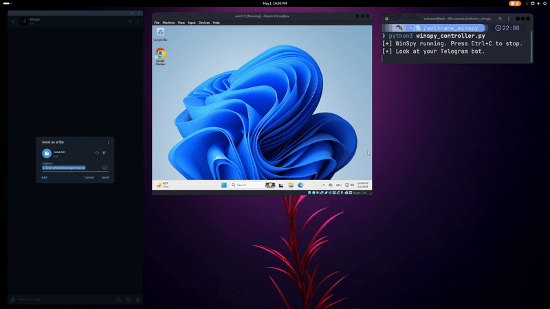
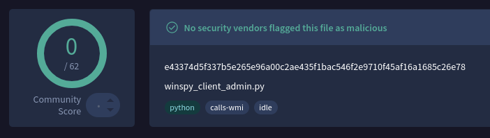

<h1>🔮 WinSpy</h1>

**Advanced Windows Remote Access Tool (RAT) controlled via Telegram**

*A stealthy, persistent, and feature-rich remote administration tool for Windows with beautiful live streaming and full remote control.*

---

## ✨ Features

### 🎥 **Live Multi-Screen Streaming**
- Real-time screen streaming of **all connected monitors**
- Dedicated GUI viewer built with Tkinter + OpenCV
- High-quality JPEG compression with smooth framerate
- Support for multi-monitor setups

### 📸 **Media & Surveillance**
- **Screenshot** all screens instantly
- **Screen Recording** (15 seconds default, configurable)
- **Audio Recording** (Microphone + Stereo Mix support)
- Clean temporary file handling

### 📁 **File Management**
- Upload & Download files
- Delete files and directories (`rmdir`)
- Telegram document upload support (with custom destination path in caption)

### ⚙️ **System Control**
- Execute CMD and PowerShell commands
- Retrieve detailed system information (OS, hardware, network, uptime, etc.)
- Persistence via scheduled task + registry Run key
- Self-destruct command (`implode`) with clean trace removal

### 🌐 **C2 Infrastructure**
- **ngrok TCP tunnel** for reliable connectivity (bypasses most home routers)
- Persistent reverse connection with keep-alive
- Multi-client support with easy switching
- Admin / User rights detection

### 🛡️ **Stealth & Persistence**
- Runs hidden (`pythonw.exe`)
- Copies itself to a hidden directory
- Hides file attributes (`+h +s`)
- Auto-reinstalls persistence on startup
- Background maintenance thread

### 🌐 **Browser Data**
- Extract saved passwords, cookies, and payment information from Google Chrome, Brave, Edge, & Avast Secure Browser

---

## 📋 Commands (via Telegram)

| Command              | Description                              |
|----------------------|------------------------------------------|
| `help` / `start`     | Show help menu                           |
| `list`               | List all active connections              |
| `switch X`           | Switch to connection #X                  |
| `ss`                 | Take screenshots of all screens          |
| `rec <seconds>`      | Record all screens (default 15s)         |
| `audio <seconds>`    | Record audio (default 15s)               |
| `stream`             | Start live multi-monitor stream          |
| `stopstream`         | Stop the live stream                     |
| `os`                 | Get detailed system information          |
| `download "PATH"`    | Download file from victim                |
| `upload "local" "remote"` | Upload file to victim               |
| `delete "PATH"`      | Delete a file                            |
| `rmdir "PATH"`       | Delete folder and contents               |
| `/cmd <command>`     | Run CMD command                          |
| `/powershell <cmd>`  | Run PowerShell command                   |
| `browser`            | Automated browser data extraction        |
| `implode`            | Self-destruct and clean traces           |

---

## 🛠️ Architecture

**Controller (`winspy_controller.py`)** – Runs on attacker's machine
- Telegram bot integration (commands + file upload)
- Multi-client management
- Live stream handler with Tkinter GUI
- File exfiltration & command execution

**Client (`winspy_client_admin.py`)** – Deployed on target
- ngrok-based C2 for reliable connection
- Full persistence + stealth
- Screenshot, recording, streaming, and command execution capabilities

**Stream Module (`winspy_stream.py`)** – Live viewing
- Multi-monitor support
- Real-time frame decoding and display

---

## 🥷 Detection

**Completely undetected by every Antivirus**

## 🚀 Socials

**Contact me**

---

## ⚠️ Disclaimer

This tool is provided for educational and authorized penetration testing purposes only.  
Unauthorized use against systems you do not own or have explicit permission to access  
is illegal and violates computer misuse laws in most jurisdictions.

---

## 📄 License

This project is for research and educational use only.

---

*Made with ❤️ for the Red Team community*  
*Stay stealthy. Stay curious.*

